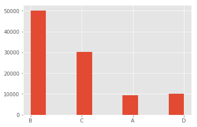

## Ejercicio 6
**Dada una función de probabilidad empírica:**
**$$p(a) = 0.1$$**
**$$p(b) = 0.5$$**
**$$p(c) = 0.3$$**
**$$p(d) = 0.1$$**
**Aplicar el método de la transformada inversa para generar 100.000 números que siguen esta distribución, dados 100.000 números uniformemente generados.**

Para ello debemos ver la función de probabilidad acumulada y luego separar en "secciones" donde se mappearan los valores uniformes $[0, 1]$ a los valores $[A; B; C; D]$.
$$P(A) = 0.1$$
$$P(B) = 0.6$$
$$P(C) = 0.9$$
$$P(D) = 1.0$$
Entonces los límites para `transformacion(x)` con `x` $\epsilon [0.0, 0.1)$ es:
$$[0.0, 0.1) -> A$$
$$[0.1, 0.6) -> B$$
$$[0.6, 0.9) -> C$$
$$[0.9, 1.0] -> D$$

**Implementación de lo anteriormente analizado**
```python
import matplotlib.pyplot as plt

start = (100017 + 101055 + 97112 + 95457) / 4
mult = 1013904223
inc = 1664525
m = 2**32

uniformes = [n for n in glc_uniforme(start, mult, inc, m, 100000)]

def transformar(num):
  if num < 0.1: return "A"
  if num < 0.6: return "B"
  if num < 0.9: return "C"
  return "D"

transformados = list(map(transformar, uniformes))

plt.style.use('ggplot')
plt.hist(transformados)
plt.show()
````

**Grafico resultante:**

{ width=250px }