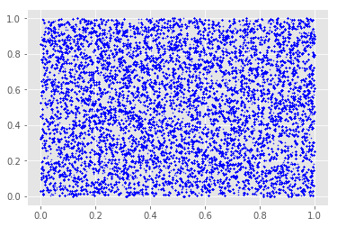
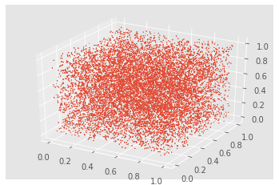

## Ejercicio 7
#### Realizar, sólo gráficamente,un test espectral en 2 y 3 dimensiones al generador congruencial lineal implementado en el ejercicio 1.
Para realizar un test espectral de **2 dimensiones** del generador congruencial lineal implementado en el ejercicio 1 seguiremos una serie de pasos:
- Generar una muestra de tamaño n ($10000$).
```python
n = 100000 #tamaño de la muestra
start = (100017 + 101055 + 97112 + 95457) / 4
mult = 1013904223
inc = 1664525
m = 2**32

uniform_random_sample = [n for n in glc_uniforme(start, mult, inc, m, n)]
```
- Agrupar los elementos de a pares. Para agruparlos se recorta la lista en el máximo tamaño posible multiplo de 2, se toman los elementos con indice par por un lado y por otro solo los de indice impar, preservando el orden
```python
maximum_2_multiple = (int(n / 2) * 2)
cut_list = uniform_random_sample[:maximum_2_multiple]
uniform_random_sample_x = cut_list[0::2]
uniform_random_sample_y = cut_list[1::2]
```

- Pasar a la función graficadora la primera y la segunda lista, las cuales serán utilizadas como valores x e y de los puntos, respectivamente.
```python
plt.plot(uniform_random_sample_x, uniform_random_sample_y, 'bo', markersize=0.5)
plt.show()
```
**Resultado:**
{ width=250px }

Para realizar un test espectral de **3 dimensiones** del generador congruencial lineal implementado en el ejercicio 1 seguiremos una serie de pasos:
- Tomar la misma muestra que en el test anterior.
- Separar en ternas de forma análoga a los pares del test anterior.
```python 
from mpl_toolkits.mplot3d import Axes3D
maximum_3_multiple = (int(n / 3) * 3)
cut_list = uniform_random_sample[:maximum_3_multiple] 
uniform_random_sample_x = cut_list[0::3]
uniform_random_sample_y = cut_list[1::3]
uniform_random_sample_z = cut_list[2::3]
```
- Pasar a la función graficadora la primera, segunda y tercer lista, las cuales serán utilizadas como valores x, y, z de los puntos, respectivamente.

```python 
ax = plt.subplot(111, projection='3d')
ax.scatter(uniform_random_sample_x, uniform_random_sample_y, uniform_random_sample_z, s=0.5)
plt.show()
```
**Resultado:**
{ width=250px }